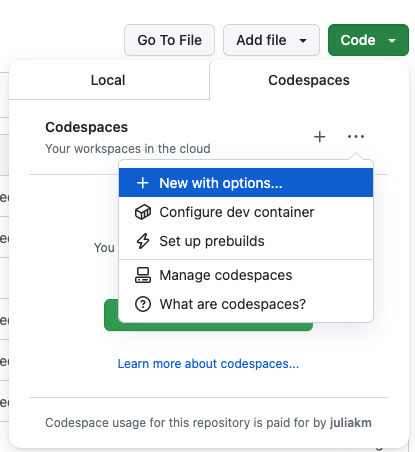
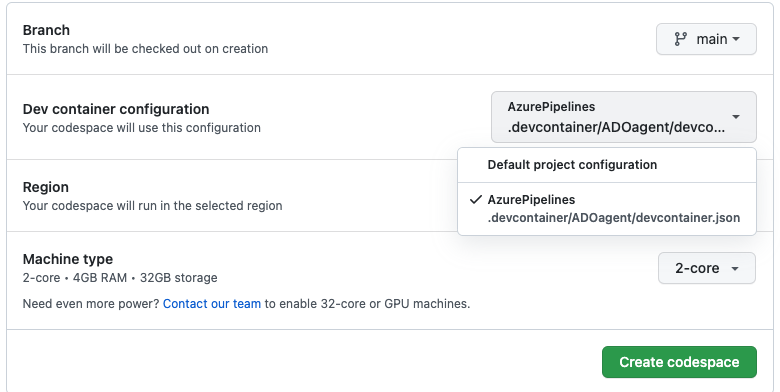

# Demo: Complete an Azure Pipelines Learn interactive module with GitHub Codespaces

This is a demo repository for testing Azure DevOps-focused Learn interactive modules with [GitHub Codespaces](https://github.com/features/codespaces).

You can use this repo to:

* Create a [self-hosted Linux Azure DevOps agent](https://learn.microsoft.com/azure/devops/pipelines/agents/v2-linux) that runs in a codespaces
* Build a Codespaces development environment where you can run the interactive module, [Create a build pipeline with Azure Pipelines](https://learn.microsoft.com/training/modules/create-a-build-pipeline/)


## Prerequisites

* A GitHub account
* An Azure DevOps organization

## Fork the sample code

For the following repository:

```
https://github.com/juliakm/pipelines-codespaces-tailspin.git
```

## Create an Azure DevOps personal access token (PAT)

You'll need to [create a new PAT to use with your self-hosted agent](https://learn.microsoft.com/azure/devops/organizations/accounts/use-personal-access-tokens-to-authenticate). 

1. Go to `https://dev.azure.com/{yourorganization}`. 

1. Create a new PAT with the scope **Agent Pools (Read & manage)** and **Deployment Groups (Read & manage)**. 

1. Copy the PAT token value and store it in a secure space. You'll use the PAT token as a GitHub secret value. 

## Create GitHub Secrets

You'll create GitHub secrets to run with your Azure DevOps self-hosted agent. 

1. In your GitHub repository, select **Settings** > **Secrets and variables** > **Codespaces**. 

    

1. Create three new Codepsaces secrets.

    
    |Name  |Value  |
    |---------|---------|
    |ADO_ORG     |   Name of the Azure DevOps organization (Example: `fabrikam`)     |
    |ADO_PAT     |   Personal Access Token value      |
    |ADO_POOL_NAME     |   Name of agent pool (Example: `codespaces-agent-pool`)      | 
    

## Build your Codespace

1. In your forked GitHub repository, select **Code**.

1. Select the **Codespaces** tab.

1. Press **...** to create a new Codespace with options.

    

1. Select the `AzurePipelines` Codespace option at `.devcontainer/ADOagent/devcontainer.json` and **Create codespace**. Leave the other default options. 

    

1. Wait for your Codespace to build. When the build completes, you'll be redirected to an online version of Visual Studio Code. 

## Complete Learn module

1. Go to [Create a build pipeline with Azure Pipelines](https://learn.microsoft.com/training/modules/create-a-build-pipeline/) and start the module.

1. When see references to the hosted Ubuntu agent, replace the code snippet with a reference to your self-hosted agent. 

    Remove this section of the YAML pipeline.

    ```yml
    pool:
      vmImage: 'ubuntu-22.04'
    ```

    Add this section of the YAML pipeline.

    ```yml
        pool:
          name: `codespaces-agent-pool`    
    ```
